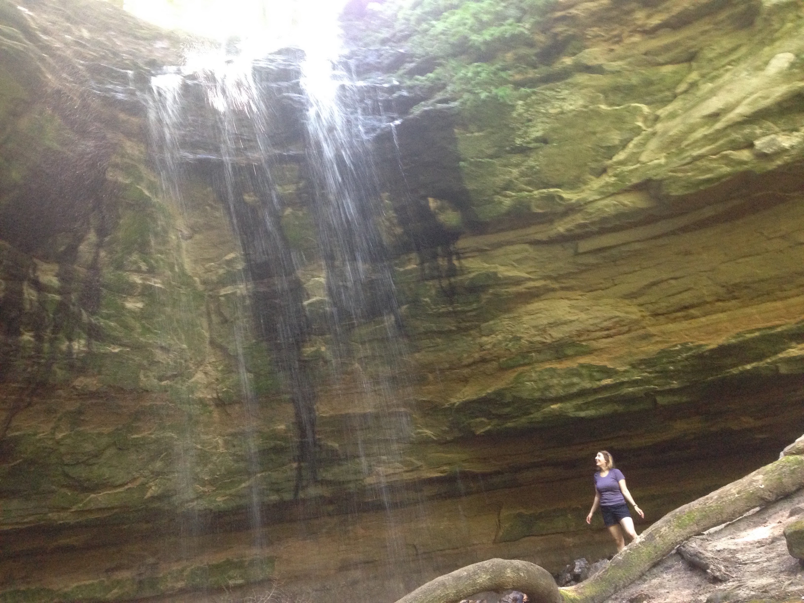

I am a Bioinformaticist in the lab of Dr. Alejandro Sánchez Alvarado. I've worked on many projects in the lab including differential gene expression analysis in various different organisms, differential isoform expression, genome annotation, motif enrichment, and more. I'm interested in the plasticity of genomes under evolutionary pressure and the circumstances and conditions determining why certain genes are maintained, duplicated, or deleted.

In my spare time I enjoy hiking, rock climbing, crocheting, running, and gardening on my smallish urban balcony.

Here's me chasing one of the beautiful waterfalls in the Upper Peninsula of Michigan! 

